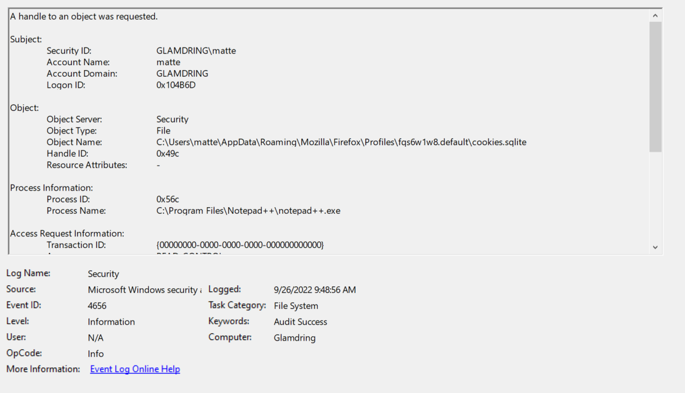

#Client Side IOC Detection
The following guide is intended to cover Windows auditing which can detect the indicators of compromise generated by TheAllCommander
##Fodhelper - "spawn_fodhelper_elevated_session" - macro
Fodhelper UAC bypass is often intercepted by Windows defender, but not always. Writes to this registry key are often still permitted and the UAC allowed. Therefore, monitoring attempts to elevate in this manner are helpful.
The attack relies on the user setting the value of the HKCU:\Software\Classes\ms-settings\Shell\Open\command registry key. Therefore, one way to detect this attack is to observe setting the value of this registry key. Since it appears very rare that legitimate applications and business workflows will need to set this value, this indicator will usually work reliably.
1) Enable Audit object access "Success and Failure" for the system under the group policy
2) Enable Auditing of "Set Value" on the key directly or one of its parent keys
3) Filter for
	Windows Event ID == 4657 AND
	Object Name LIKE \REGISTRY\USER\<ID regular expression>_Classes\ms-settings\Shell\Open\command

##Cookie Harvest - "harvest_cookies" - macro
Two Windows events are helpful for detecting access for cookies. 4656 is generated when a process requests access to an object, and 4663 is generated when the process actually accesses the object. Turning on this sort of auditing is excessively noisy unless very finely calibrated, as there is the potential to log every time that any process accesses any file or object. This will overwhelm most storage systems quickly, and SIEM license caps can be exceeded quickly. These instructions are calibrated to audit only the files specifically used for cookies.
1) Enable Audit object access "Success and Failure" for the system under the group policy
2) Enable Auditing of "Read" on the cookie files for the browser being used
3) Filter for 
	Windows Event ID == 4656 OR 4663 AND
	Object Name == <target cookie file> AND
	Process Name != <target browser> AND
	Process Name != <backup software solution>
	
##Outlook Harvest - "harvest_outlook" - macro
Outlook files are stored as .pst and .ost, both of which can be read to grab stored emails. Similar logic can be used to identify compromise of these files as we used with browser cookies.
1) Enable Audit object access "Success and Failure" for the system under the group policy
2) Enable Auditing of "Read" on the system's Outlook folders
3) Filter for 
	Windows Event ID == 4656 OR 4663 AND
	Object Name LIKE *.pst OR LIKE *.ost AND
	Process Name != Outlook AND
	Process Name != <backup software solution>
##Cookie Deletion  - "delete_cookies" - macro
1) Enable Audit object access "Success and Failure" for the system under the group policy
2) Enable auditing for file deletion on the browser cookie files
3) Filter for:
	Windows Event ID == 4656 AND
	Process Name != Expected browser AND
	Accesses INCLUDES "DELETE"

##Empty Recycle Bin - "empty_recycle_bin" - macro
Attackers remove items from the recycle to cover their tracks in a variety of ways. One of the most simple and efficient ways of doing is to delete the %systemdrive%\$Recycle.Bin folder. This method also will not usually be employed by legitimate applications. To that end, it's worth checking for deletions of this folder. 
At this time, I can only offer a modest fidelity detection which will detect the specific implementation chosen by TheAllCommander, but there are other techniques for deleting the folder which are not detected by this technique.
1) Enable auditing of processes
2) Enable logging of command line for process creation
3) Filter for:
	Windows Event ID = 4688
	Process Command Line LIKE "del <regular expression for spaces and arguments> $Recycle.Bin"
##Enumerate Users - "enumerate_users" - macro
TheAllCommander uses the net command to enumerate users in a very simplistic enumeration strategy. The technique for monitoring for use of the net command for enumeration with the following rule requires that only a manageable pool of system administrators are using net for managing the user base. If the rights to perform these functions are permitted for nominal users, then this technique generates false notifications.
Please note that net can be executed as net or net1, as net simply invokes net1. Rules that are tied simply to net.exe will fail with the simple bypass of invoking net1.
1) Enable auditing of processes
2) Enable logging of command line for process creation
3) Filter for:
	Windows Event ID = 4688
	Process Command Line LIKE "net.exe *" OR "net1.exe *" OR "net *" OR "net1 *"
	
To augment this technique, it is wise to create a honeypot user account that no one has a real business reason to be accessing. Enable the account with an impossible password and no permissions to anything. 
1) Enable Audit Successful Directory Service Access
2) Under "Auditing", enable auditing for "Full Control" for the honeypot user
3) Filter for:
	Windows Event ID = 4662
	Account Name = <your honeypot>
	
Any time anyone performs domain or system wide enumeration, such as with "net user /domain", the user will be accessed and 4662 will be generated. This can, of course, still happen with nominal housekeeping, but it is much more granular than trying to track all accesses of "net". It is also more comprehensive, as techniques which bypass net to enumerate users will still be captured.
##LSASS Dump
###rundll32.exe C:\windows\System32\comsvcs.dll, MiniDump <LSASS PID> lsass.dmp full
This technique is blocked by default by Windows Defender easily, so we're not going to look at detection here
###ProcDump
This technique is blocked by default by Windows Defender easily, so we're not going to look at detection here